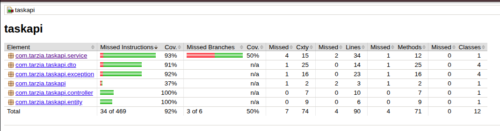
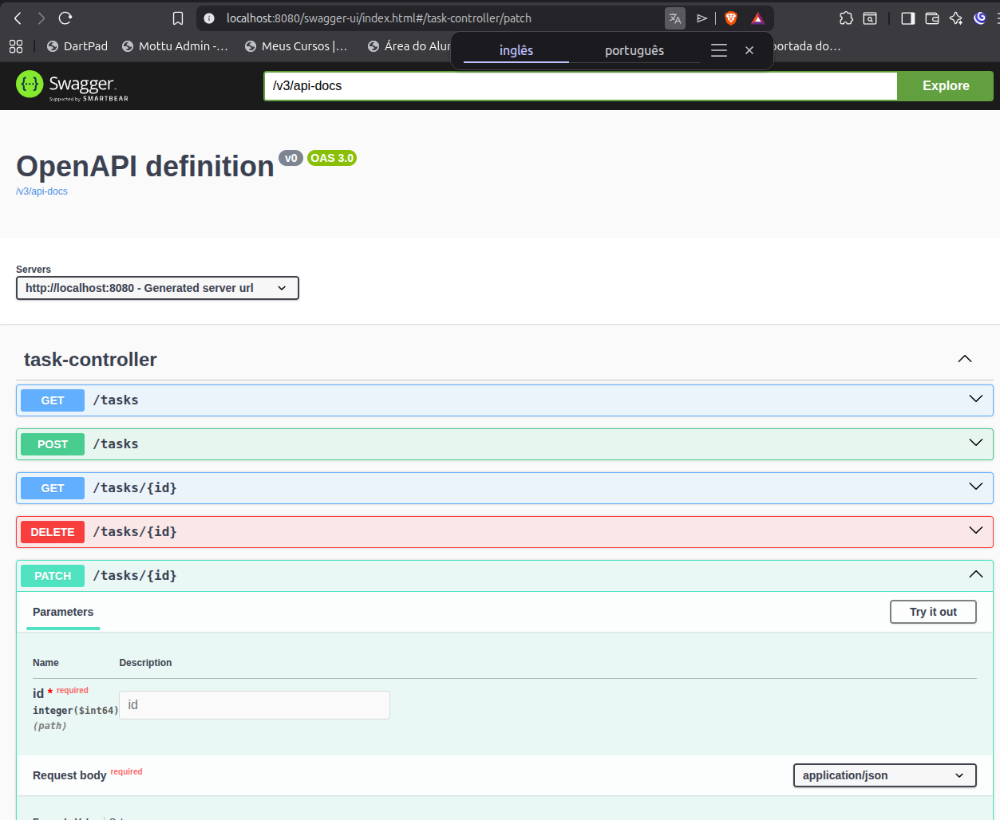

# Task API

API REST para gerenciamento de tarefas, desenvolvida com Spring Boot com foco em boas práticas, arquitetura em camadas e cobertura de testes.

---

## 🚀 Tecnologias

| Tecnologia | Versão |
|---|---|
| Java | 17 |
| Spring Boot | 3.2.5 |
| Spring Data JPA | — |
| H2 Database | — |
| Lombok | — |
| SpringDoc OpenAPI (Swagger) | 2.5.0 |
| JUnit 5 + Mockito | via `spring-boot-starter-test` |
| JaCoCo | 0.8.12 |

---

## 📁 Arquitetura

O projeto segue separação em camadas:

```
controller   → entrada HTTP, validação de request
service      → regras de negócio
repository   → acesso a dados (Spring Data JPA)
dto          → contratos de entrada e saída
entity       → modelo de dados
exception    → tratamento global de erros (GlobalExceptionHandler)
```

---

## 📌 Endpoints

| Método | Rota | Descrição |
|---|---|---|
| `GET` | `/api/health` | Verifica se a API está online |
| `GET` | `/api/tasks` | Lista tarefas com paginação |
| `GET` | `/api/tasks/{id}` | Busca tarefa por ID |
| `POST` | `/api/tasks` | Cria nova tarefa |
| `PATCH` | `/api/tasks/{id}` | Atualização parcial (título, descrição, status) |
| `PATCH` | `/api/tasks/{id}/complete` | Marca tarefa como concluída |
| `DELETE` | `/api/tasks/{id}` | Remove tarefa |

### Contrato padrão de resposta

Todos os endpoints da API (exceto rotas de infraestrutura como Swagger/Actuator) retornam o mesmo envelope JSON:

```json
{
  "success": true,
  "message": "Operação realizada com sucesso.",
  "data": {},
  "timestamp": "2026-03-27T14:52:41.533"
}
```

- `success`: `true` para sucesso, `false` para erro
- `message`: mensagem padronizada da operação
- `data`: payload de negócio (ou `null` quando não houver conteúdo)
- `timestamp`: data/hora da resposta

### Por que o BaseResponse e importante?

- Padroniza sucesso e erro no mesmo formato, facilitando consumo no front-end
- Reduz duplicacao de logica nos controllers com o `ApiResponseBodyAdvice`
- Simplifica observabilidade e debug, pois toda resposta inclui `timestamp` e `message`
- Facilita evolucao da API sem quebrar o contrato principal da resposta

### Paginação

```
GET /api/tasks?page=0&size=10
```

### Exemplo — Health check

```json
GET /health
{
  "success": true,
  "message": "Operação realizada com sucesso.",
  "data": {
    "online": true
  },
  "timestamp": "2026-03-27T14:52:41.533"
}
```

### Exemplo — Criar tarefa

```json
POST /api/tasks
{
  "title": "Estudar Spring Boot",
  "description": "Revisar documentação oficial"
}

{
  "success": true,
  "message": "Operação realizada com sucesso.",
  "data": {
    "id": 1,
    "title": "Estudar Spring Boot",
    "description": "Revisar documentação oficial",
    "completed": false
  },
  "timestamp": "2026-03-27T14:52:41.533"
}
```

### Exemplo — Atualização parcial

```json
PATCH /api/tasks/1
{
  "title": "Novo título",
  "completed": true
}
```

### Respostas de erro

| Status | Situação |
|---|---|
| `400` | Payload inválido (ex: `title` em branco) |
| `404` | Tarefa não encontrada |

Exemplo (`404`):

```json
{
  "success": false,
  "message": "Task not found",
  "data": null,
  "timestamp": "2026-03-27T14:52:41.533"
}
```

---

## 🧪 Testes

O projeto adota testes em duas camadas:

- **Unitários** (`TaskServiceTest`) — lógica de negócio isolada com Mockito
- **Web** (`TaskControllerWebMvcTest`) — contratos HTTP com MockMvc (`@WebMvcTest`)
- **Exceções** (`GlobalExceptionHandlerTest`) — respostas de erro 400 e 404

### Cobertura (JaCoCo)

| Pacote | Cobertura |
|---|---|
| `controller` | 100% |
| `exception` | 92% |
| `dto` | 91% |
| `service` | 77% |
| **Total** | **~87%** |

### Rodar os testes

```bash
mvn test
```

### Gerar relatório de cobertura

```bash
mvn verify
```

Relatório disponível em: `target/site/jacoco/index.html`

---

## ▶️ Executando o projeto

```bash
mvn spring-boot:run
```

Depois, acesse:

```bash
curl http://localhost:8080/api/health
```

---

## 📖 Documentação (Swagger)

```
http://localhost:8080/api/docs
```

---

## 💡 Observações

- Banco H2 em memória — dados não persistem após reiniciar
- Validação de entrada com `@Valid` e `@NotBlank`
- Respostas seguem envelope padrão com `success`, `message`, `data` e `timestamp`

---

## 📬 Autor

**Erick Tarzia**
